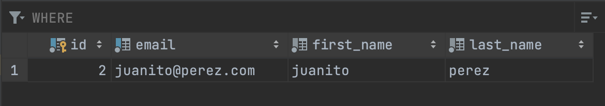

# Basic CRUD with Spring Data JPA

Endpoint : ```"/Client"```

## POST (create)

Req. body :

```
{

    "firstName": "luk",
    "lastName": "stocker",
    "email": "luk@stocker.com"
    
}
```

Response :

```
{
    "id": 1,
    "firstName": "luk",
    "lastName": "stocker",
    "email": "luk@stocker.com"
}
```

## GET (read)

(no req. body needed since its read)


Response :

```
[
    {
        "id": 1,
        "firstName": "luk",
        "lastName": "stocker",
        "email": "luk@stocker.com"
    },
    {
        "id": 2,
        "firstName": "juanito",
        "lastName": "perez",
        "email": "juanito@perez.com"
    }
]
```

## PUT (update)

Req. body : 

```
{
    "id": 1,
    "firstName": "juan",
    "lastName": "ropdriguez",
    "email": "juan@rodriguez.com"
}
```

Response :

```
{
    "id": 1,
    "firstName": "juan",
    "lastName": "ropdriguez",
    "email": "juan@rodriguez.com"
}
```

## DELETE (delete)

(no req: body needed since we pass to-be-deleted client id as url parameter)

url : ```/client/1```


### Final GET returns

```
[
    {
        "id": 2,
        "firstName": "juanito",
        "lastName": "perez",
        "email": "juanito@perez.com"
    }
]
```

## POSTGRESQL Client table




